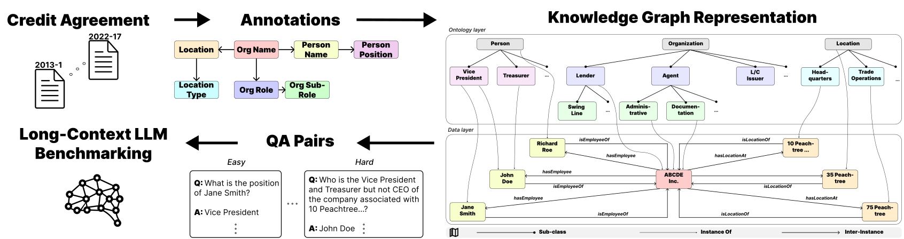

# KG-QAGen: A Knowledge-Graph-Based Framework for Systematic Question Generation and Long-Context LLM Evaluation

<p align="center">
  <a href="https://github.com/gtfintechlab/KG-QAGen">
    
  </a>
  <a href="https://huggingface.co/datasets/gtfintechlab/KG-QAGen-D">
    
  </a>
  <a href="https://arxiv.org/abs/YYYY.MM.NNNNN">
    
  </a>
</p>

KG‑QAGen is a framework that leverages structured annotations of large documents to build knowledge graphs and systematically extract QA pairs at controlled difficulty levels, enabling fine‑grained evaluation of long‑context LLMs.

<p align="center">
  
</p>

*Overview of KG-QAGen. Credit agreements are annotated to identify entities and their relationships, forming a knowledge graph representation. This graph is then used to systematically extract multi-level QA pairs, which serve as the basis for benchmarking long-context LLMs.*


## KG‑QAGen‑D Dataset

We produce **KG‑QAGen‑D**, a 20,139-question benchmark derived from 170 SEC credit agreements (2013–2022). Each QA pair is tagged with a composite complexity level (L = #hops + #set‑ops + plurality), split into *Easy*, *Medium*, and *Hard*.

## Leaderboard & Evaluation Platform

To facilitate reproducibility and future research, we release the **KG‑QAGen‑D** dataset under a [CC-BY-NC-ND 4.0 license](https://creativecommons.org/licenses/by-nc-nd/4.0/). The dataset is divided into development and test sets as follows:

| **Stats**                 |   **Dev** |   **Test** |  **Total** |
| ------------------------- | --------: | ---------: | ---------: |
| # Documents               |        40 |        130 |        170 |
| # Questions per Doc (Min) |         1 |          1 |          1 |
| # Questions per Doc (Avg) |     14.75 |      23.49 |      21.44 |
| # Questions per Doc (Max) |       83  |        428 |        428 |
| # Easy Questions          |     1,499 |      5,051 |      6,550 |
| # Medium Questions        |     2,680 |     10,203 |     12,883 |
| # Hard Questions          |       239 |        467 |        706 |
| **Total Questions**       | **4,418** | **15,721** | **20,139** |

* **Development Set (~25%)**: 40 documents and 4,418 QA pairs are publicly released to support model development and validation.
* **Test Set (~75%)**: 130 documents and 15,721 QA pairs are **not released** to prevent data contamination and ensure fair evaluation (questions are released for the leaderboard).

### Online Leaderboard

We will host an evaluation leaderboard on **[Hugging Face](https://huggingface.co/)** upon acceptance of the paper.

## Contact

For questions or issues, please reach out to:

- Nikita Tatarinov: [ntatarinov3@gatech.edu](mailto:ntatarinov3@gatech.edu)
- Agam Shah: [ashah482@gatech.edu](mailto:ashah482@gatech.edu)

## Running the codes

1. Ensure the files from HuggingFace are placed in `data/questions` directory. For inference only, files without ground-truth answers are sufficient. To run benchmarking, ground-truth answers are also required.

2. Ensure you have [conda or Anaconda/Miniconda](https://docs.conda.io/en/latest/) installed.

3. In your terminal, navigate to the project directory.

4. To create the necessary conda environment, run:

```bash
conda env create -f environment.yml
```

5. Once environment creation finishes, activate it:

```bash
conda activate kgqagen
```

6. Customize `inference/config.py` file to run benchmarking in a specific setting.

   - Customize `QUESTION_FILE` to change the complexity level of questions to benchmark on.

   - Customize `LLM_PROVIDER` and `MODEL_NAME` to change the model to benchmark.

   - Customize `TESTING_REGIME` to change the benchmarking setting.

      - Use "FULL" for benchmarking LLMs with entire documents.

      - Use "RAG" for benchmarking LLMs with RAG (retrieval-augmented generation).

      - Use "GOLD" for benchmarking LLMs with pieces of documents containing the answer (Oracle setting).

7. For inference, navigate to `inference` directory.

   - (Optional) For benchmarking with RAG, create a vectore store:

   ```bash
   python vector_db_builder.py
   ```

   - Run the inference:

   ```bash
   python main.py
   ```

8. For benchmarking, navigate to `benchmarking` directory.

   - Regroup the questions into "Easy", "Medium" and "Hard" categories:

   ```bash
   python restructure.py
   ```

   - Run the metrics calculation. Remove `--llm-as-a-judge` to calculate all metrics but LLM-as-a-Judge. Add `--llm-provider openai` to use OpenAI's gpt-4o as a judge (use OpenAI API key then).

   ```bash
   python metrics.py --llm-as-a-judge [Gemini API key]
   ```

## Citation

If you use KG‑QAGen in your work, please cite:

```bibtex
@misc{tatarinov2025kgqagenknowledgegraphbasedframeworksystematic,
      title={KG-QAGen: A Knowledge-Graph-Based Framework for Systematic Question Generation and Long-Context LLM Evaluation}, 
      author={Nikita Tatarinov and Vidhyakshaya Kannan and Haricharana Srinivasa and Arnav Raj and Harpreet Singh Anand and Varun Singh and Aditya Luthra and Ravij Lade and Agam Shah and Sudheer Chava},
      year={2025},
      eprint={2505.12495},
      archivePrefix={arXiv},
      primaryClass={cs.CL},
      url={https://arxiv.org/abs/2505.12495}, 
}
