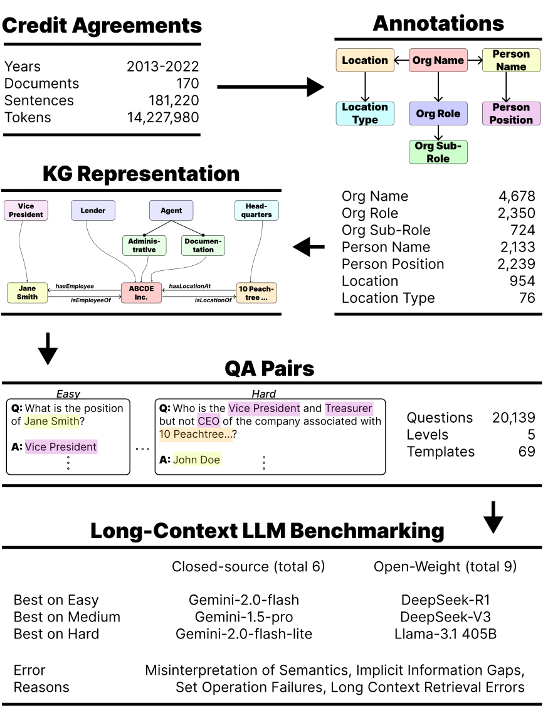
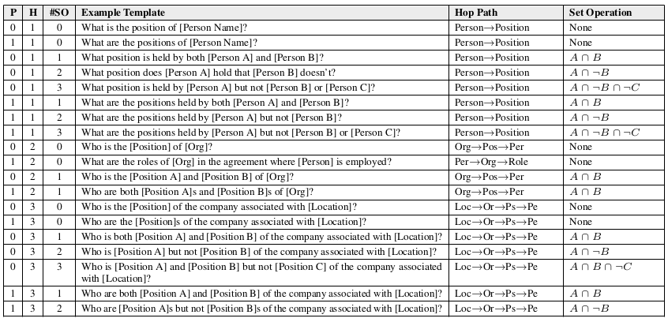
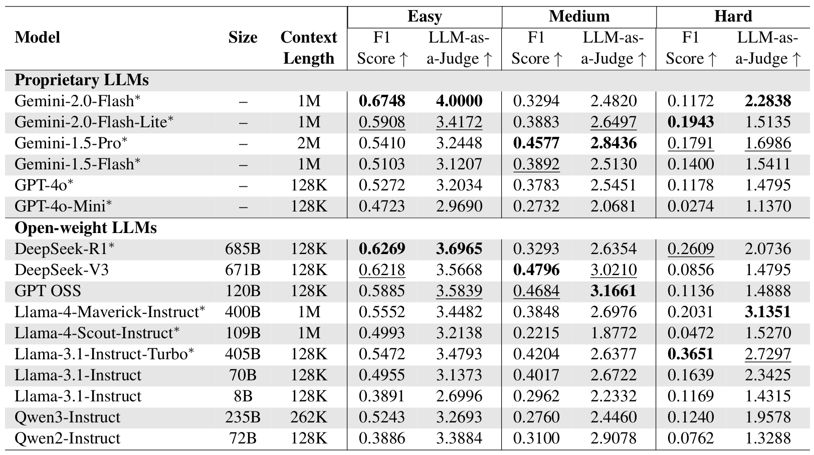

# KG-MuLQA: A Framework for KG-based Multi-Level QA Extraction and Long-Context LLM Evaluation

<p align="center">
  <a href="https://arxiv.org/abs/2505.12495">
    
  </a>
  <a href="https://huggingface.co/datasets/gtfintechlab/KG-MuLQA-D">
    
  </a>
  <a href="https://github.com/gtfintechlab/KG-MuLQA">
    
  </a>
</p>

KG‑MuLQA is a framework that (1) extracts QA pairs at multiple complexity levels (2) along three key dimensions -- multi-hop retrieval, set operations, and answer plurality, (3) by leveraging knowledge-graph-based document representations.

<p align="center">
  
</p>

*Overview of KG-MuLQA. Credit agreements are annotated to identify entities and their relationships, forming a knowledge graph representation. This graph is then used to systematically extract multi-level QA pairs, which serve as the basis for benchmarking long-context LLMs.*


## KG‑MuLQA-D Dataset

We produce **KG‑MuLQA‑D**, a dataset of 20,139 QA pairs derived from 170 SEC credit agreements (2013–2022) and categorized by five complexity levels. Each QA pair is tagged with a composite complexity level (L = \#hops + \#set‑ops + plurality), split into *Easy*, *Medium*, and *Hard*.

<p align="center">
  
</p>

*This table illustrates the question templates used to construct KG-MuLQA-D, structured along three dimensions: plurality (P), number of hops (H), and set operations (\#SO). It includes example templates, corresponding knowledge graph query paths, and logical operations involved. These dimensions are used to compute the overall complexity level for each QA pair. The full list of templates can be found in the paper.*

## LLM Benchmarking & Evaluation

We evaluate 16 proprietary and open-weight LLMs on KG-MuLQA-D benchmark. As question complexity increases, the LLM's ability to retrieve and generate correct responses degrades markedly. We categorize observed LLM failures into four major types, each of which presents recurring challenges as question complexity increases: Misinterpretation of Semantics, Implicit Information Gaps, Set Operation Failures, and Long-Context Retrieval Errors. See the paper for detailed analysis.

<p align="center">
  
</p>

*This table presents the performance of 16 LLMs, evaluated across Easy, Medium, and Hard question categories. The metrics include the F1 Score and the LLM-as-a-Judge rating, capturing both token-level accuracy and semantic correctness. The results reveal a consistent decline in performance as question complexity increases, with notable model-specific strengths and weaknesses. \* denotes the models evaluated on a smaller subset due to cost constraints (see the paper for extended evaluation).*

## Benchmarking Codes

To facilitate reproducibility and future research, we release our inference pipeline and benchmarking codes under a [CC-BY-NC-ND 4.0 license](https://creativecommons.org/licenses/by-nc-nd/4.0/).

1. Ensure the files from HuggingFace are placed in `data/questions` directory. For inference only, files without ground-truth answers are sufficient. To run benchmarking, ground-truth answers are also required.

2. Ensure you have [conda or Anaconda/Miniconda](https://docs.conda.io/en/latest/) installed.

3. In your terminal, navigate to the project directory.

4. To create the necessary conda environment, run:

```bash
conda env create -f environment.yml
```

5. Once environment creation finishes, activate it:

```bash
conda activate kgmulqa
```

6. Customize `inference/config.py` file to run benchmarking in a specific setting.

   - Customize `QUESTION_FILE` to change the complexity level of questions to benchmark on.

   - Customize `LLM_PROVIDER` and `MODEL_NAME` to change the model to benchmark.

   - Customize `TESTING_REGIME` to change the benchmarking setting.

      - Use "FULL" for benchmarking LLMs with entire documents.

      - Use "GOLD" for benchmarking LLMs with pieces of documents containing the answer (Oracle setting).

      - Use "RAG" for benchmarking LLMs with RAG (retrieval-augmented generation).
  
  - (Optional) For benchmarking RAG, customize `RAG_MODE` to change RAG setting.

      - Use "STATIC" for static RAG (selects top passages using a retriever).

      - Use "DYNAMIC" for dynamic RAG (iteratively decomposes the question into sub-queries, retrieves relevant passages across multiple steps, and aggregates the retrieved evidence before generating the final answer).

7. For inference, navigate to `inference` directory.

   - (Optional) For benchmarking with RAG, create a vector store:

   ```bash
   python vector_db_builder.py
   ```

   - Run the inference:

   ```bash
   python main.py
   ```

8. For benchmarking, navigate to `benchmarking` directory.

   - Regroup the questions into "Easy", "Medium" and "Hard" categories:

   ```bash
   python restructure.py
   ```

   - Run the metrics calculation. Remove `--llm-as-a-judge` to calculate all metrics but LLM-as-a-Judge. Add `--llm-provider openai` to use OpenAI's gpt-4o as a judge (use OpenAI API key then).

   ```bash
   python metrics.py --llm-as-a-judge [Gemini API key]
   ```

## Citation

If you use KG‑MuLQA in your work, please cite:

```bibtex
@misc{tatarinov2025kgqagenknowledgegraphbasedframeworksystematic,
      title={KG-QAGen: A Knowledge-Graph-Based Framework for Systematic Question Generation and Long-Context LLM Evaluation}, 
      author={Nikita Tatarinov and Vidhyakshaya Kannan and Haricharana Srinivasa and Arnav Raj and Harpreet Singh Anand and Varun Singh and Aditya Luthra and Ravij Lade and Agam Shah and Sudheer Chava},
      year={2025},
      eprint={2505.12495},
      archivePrefix={arXiv},
      primaryClass={cs.CL},
      url={https://arxiv.org/abs/2505.12495}, 
}
```

For questions or issues, please reach out to:

- Nikita Tatarinov: [ntatarinov3@gatech.edu](mailto:ntatarinov3@gatech.edu)
- Agam Shah: [ashah482@gatech.edu](mailto:ashah482@gatech.edu)
